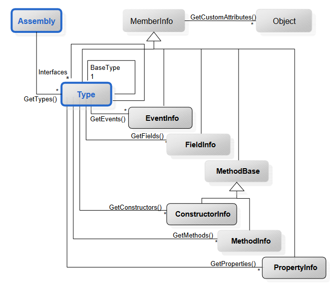
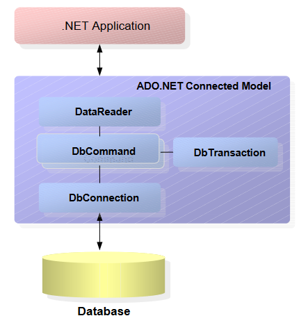

# C#

TODO:
- Was sind Delegates?
- Link für Dokumentation von C# Klassen
- welches Interface Implementieren, damit foreach funktioniert?

- [C](#c)
  - [HelloWorld-Programm](#helloworld-programm)
  - [Programme übersetzen](#programme-übersetzen)
  - [Namenskonventionen](#namenskonventionen)
  - [Typen](#typen)
    - [Enums](#enums)
  - [Arrays, Listen und HashMap](#arrays-listen-und-hashmap)
    - [Arrays](#arrays)
    - [Listen](#listen)
    - [HashMaps](#hashmaps)
  - [Operatoren und Ausdrücke](#operatoren-und-ausdrücke)
  - [Switch und foreach-Schleife](#switch-und-foreach-schleife)
  - [Deklarationen](#deklarationen)
  - [Namespaces](#namespaces)
  - [Klassen/Structs](#klassenstructs)
    - [Beispiel Struct](#beispiel-struct)
    - [Aufbau Klasse](#aufbau-klasse)
    - [`const`, `static` und `readonly`](#const-static-und-readonly)
    - [Arten von Parametern bei Methoden](#arten-von-parametern-bei-methoden)
    - [Konstruktoren](#konstruktoren)
    - [Geschachtelte Klassen](#geschachtelte-klassen)
    - [Klasse aus mehrere Teilen](#klasse-aus-mehrere-teilen)
    - [Properties](#properties)
    - [Indexer](#indexer)
    - [Überladene Operatoren](#überladene-operatoren)
    - [Vererbung](#vererbung)
    - [Abstrakte Klassen](#abstrakte-klassen)
    - [Interfaces](#interfaces)
    - [Operationen auf Klassen/Typen](#operationen-auf-klassentypen)
  - [I/O Operationen](#io-operationen)
    - [Ausgabe Konsole](#ausgabe-konsole)
    - [Tastatur Eingabe](#tastatur-eingabe)
  - [Delegates und Events](#delegates-und-events)
    - [Delegates](#delegates)
    - [Events](#events)
  - [Exceptions](#exceptions)
  - [Attribute](#attribute)
  - [Generische Typen](#generische-typen)
- [.NET Klassenbibliothek](#net-klassenbibliothek)
  - [Wichtigste Namespaces:](#wichtigste-namespaces)
  - [Math](#math)
  - [Random](#random)
  - [DateTime](#datetime)
  - [Strings und Zeichenketten](#strings-und-zeichenketten)
  - [Regex](#regex)
  - [Collections](#collections)
    - [IEnumerable<T> und IEnumerator<T>](#ienumerablet-und-ienumeratort)
    - [ICollection<T>](#icollectiont)
    - [IList<T>](#ilistt)
      - [Array](#array)
      - [List<T>](#listt)
      - [LinkedList<T>](#linkedlistt)
    - [IDictionary<K,V>](#idictionarykv)
      - [KeyValue Pair](#keyvalue-pair)
      - [Dictionary<K,V>](#dictionarykv)
      - [SortedList<K,V>](#sortedlistkv)
    - [Queue/Stack/BitArray](#queuestackbitarray)
  - [IComparable<T> und IComparer<T>](#icomparablet-und-icomparert)
  - [Streaming Framework](#streaming-framework)
    - [Lesen/Schreiben auf Datei](#lesenschreiben-auf-datei)
  - [Threading](#threading)
    - [Thread Beispiele:](#thread-beispiele)
    - [Gegenseitiger Ausschluss](#gegenseitiger-ausschluss)
  - [XML](#xml)
    - [Verarbeitung von XML Dokumenten](#verarbeitung-von-xml-dokumenten)
    - [XMLDocument und XmlNode](#xmldocument-und-xmlnode)
    - [XPath](#xpath)
    - [XMLReader](#xmlreader)
    - [XMLWriter](#xmlwriter)
  - [Networking](#networking)
    - [Adressierung:](#adressierung)
    - [DNS](#dns)
    - [Sockets](#sockets)
    - [WebRequest und WebResponse](#webrequest-und-webresponse)
  - [Reflection](#reflection)
  - [Low-Level Programming](#low-level-programming)
- [Datenzugriff mit ADO.NET](#datenzugriff-mit-adonet)
  - [Verbindungsorientierter Zugriff](#verbindungsorientierter-zugriff)
    - [IDbConnection](#idbconnection)
    - [IDbCommand](#idbcommand)
    - [IDbTransaction](#idbtransaction)
    - [IDataReader](#idatareader)
  - [Verbindungsloser Zugriff](#verbindungsloser-zugriff)
  - [Datenbankeigenschaften](#datenbankeigenschaften)

## HelloWorld-Programm
```csharp
class Program
{
    static void Main(string[] args)
    {
        Console.WriteLine("Hello World!");
    }
}
```

## Programme übersetzen
```
$ csc Program.cs -> erzeugt Program.exe
$ csc /target.exe Program.cs Library.cs -> erzeugt Program.exe
$ csc /t:library Library.cs -> erzeugt Library.dll
```

## Namenskonventionen
* Namen von Variablen, Funktionen etc. werden in Camel Case geschrieben, z.B. AddEntry
* Dürfen nicht nur aus Schlüsselwörter bestehen
* Gross- und Kleinschreibung spielt eine Rolle
* Anfangsbuchstabe gross: Konstanten (alles gross), öffentliche Felder, Properties, Enum-Konstanten, Methoden, Typen, Namensräume
* Anfangsbuchstabe klein: lokale Variablen, private Felder

## Typen
* Werte: Enthalten Werte, liegen auf dem Stack, Zuweisung kopiert Wert
* Referenzen: Enthalten Referenzen auf Objekt, liegt auf dem Heap, Zuweisung kopiert Referenz


### Enums
```csharp
enum Color {Red, Blue, Green} // Werte 0,1,2
enum Access {Personal=1, Group=2, All=4} // Werte 1,2,4
enum AccessByte : byte {Personal=1, Group=2, All=4}

String[] names = Enum.GetNames(typeof(Color));
Color color = (Color) Enum.Parse(typeof(Color), "Red");
```

## Arrays, Listen und HashMap
### Arrays
```csharp
int[] a = new int[3];
int[] b = new int[] { 1,2,3 };
int[] c = { 1,2,3 };

// mehrdimensionale Arrays
int[][] d = new int[2][];
d[0] = new int[2];
d[1] = new int[3];
d[0][0] = 1;
d[0][1] = 2;
d[1][0] = 3;
d[1][1] = 4;
d[1][2] = 5;
Console.WriteLine(d[0][1]); // 2

int[,] e = new int[2, 3];
e[0, 0] = 1;
e[0, 1] = 2;
e[1, 0] = 3;
e[1, 1] = 4;
e[1, 2] = 5;
eonsole.WriteLine(e[0, 1]); // 2
```
### Listen
```csharp
List<string> a = new List<string>();
a.Add("Caesar");
a.Add("Dora");
a.Add("Anton");
a.Sort();
for (int i = 0; i < a.Count; i++)
    Console.WriteLine(a[i]);
```
### HashMaps
```csharp
Dictionary<string,int> phone = new Dictionary<string,int>();
phone["Karin"] = 7131;
phone["Peter"] = 7130;
phone["Wolfgang"] = 7132;
string[] keys = new string[phone.Count];
phone.Keys.CopyTo(keys,0);
for (int i = 0; i < keys.Length; i ++) {
    string name = keys[i];
    Console.WriteLine("{0} = {1}",name, phone[name]);
}
// oder:
for (String name in phone.Keys) {
    Console.WriteLine("{0} = {1}",name, phone[name]);
}
```

## Operatoren und Ausdrücke


* Arithmetische Ausdrücke:
  * Operanden: numerisch, char (++, -- auch bei enums)
  * Ergebnis: kleinster numerischer Typ, der beide Operanden einschliesst
* Vergleichsausdrücke:
  * <,>,<=,=> : nummerisch,char,enume
  * ==,!= : numerisch, char, enum, bool, Referenzen
  * x is T : x = beliebiger Typ , T = Referenztyp (z.B. obj is Rectangle)
  * Ergebnis: bool
* Boolesche Ausdrücke (&&,||,!)
  * Operanden: bool
  * Ergebnistyp: bool
* Bit-Ausdrücke (&,|,^,~)
  * &,|,^ : numerisch,char,enum,bool
  * ~ : numerisch,char,enum
  * unterschiedlich grosse Operanden: Operanden werden zum grösseren Typ konvertiert
  * Ergebnistyp: grössere der beiden Operanden
```csharp
// Überlaufprüfung
int x = 1_000_000
x = x*x; // overflow

x = checked(x * x); // System.OverflowException()
checked {
    x = x * x; // System.OverflowException()
}

// oder /checked flag für Compiler
```

## Switch und foreach-Schleife
```csharp
// switch-case
// Fall-Through nur bei leerem Case erlaubt!!
// wenn default Fehlt: Fortsetzung nach Switch-Anweisung
switch (country) {
    case "Germany": case "Austria": case "Switzerland":
        language = "German";
        goto case "England";
    case "England": case "USA":
        language = "English";
        break;
    default:
        Console.WriteLine("don't know language of " + country);
        break;
}

```
```csharp
// foreach-Anweisung
int[] a = {1,2,3,4,5};
foreach(int x in a) Console.WriteLine(x);

string s = "Hello";
foreach (char ch : s) Console.WriteLine(ch);
```

## Deklarationen
* Deklerationsraum: Beschschreibt den Bereich, in welchen eine deklarierte Variable gültig ist
  * Namespace, Klasse/Interface/Struct, Block, geschachtelter Block, Enum
* Keine Deklaration darf in einem Deklarationsraum mehrfach vorkommen
* Deklarationen sind meist vorher und nachher gültig
  * Aussnahme: Nicht in einem lokalen Methodenblock
* Im inneren Deklarationsraum darf eine Deklaration aber neu vorkommen (z.B. in einer Methode einer Klasse)
  * Ausnahme: Nicht in einem geschachtelten Block:
```csharp
void foo(int a) { // Parameter a gehört zu innerem Block
    int b;
    if (...) {
        int b; // Fehler: b wurde bereits vorher aussen deklariert
        int c; // Fehler: c wird bereits nachher aussen deklariert
        int d; // ok
    } else {
        int a; // Fehler: a wurde bereits vorher aussen deklariert
        int d; // ok
    }
    int c;
}
```
* Deklaration ist im Namensraum sichtbar, aber nicht ausserhalb des Deklarationsraums (also weiter oben)
* Sichtbarkeitsattribute: `private`, `public`, `protected`, `internal` (default)
* `public`: Überall dort sichtbar, wo umschliessender Namespace sichtbar ist (Standard für Interface- und Enum-Membern)
* `private`: Ist nur in deklarierender Klasse/Struct bekannt (Standard für Klassen-Membern/Struct-Membern)
* `protected`: Nur sichtbar in deklarierender Klasse/Struct und Unterklassen
* `internal`: Ist nur innerhalb eines Assemblys sichtbar (zum Beispiel kann man so API-Methoden unsichtbar gegen aussen aber nicht innerhalb des Assemblys machen)

## Namespaces


* Wenn kein Namespace angegeben: Namensloser Standardsnamensraum (Global Namespace)
* Namespaces kann Structs, Interfaces, Enums und Delegates enthalten
* Datei kann mehrere Namespaces enthalten und Namespace kann über mehrere Dateien verteilt sein
* Namespaces müssen mittels `using` importiert werden oder Namespace muss direkt angesprochen werden


## Klassen/Structs
* Klassen
  * Mittels `new` werden Instanzen erzeugt und wird auf Heap abgelegt
  * Sind Referenztypen und haben volle OO-Funktionalität
* Structs
  * Mittels `new` werden Werte erzeugt und auf dem Stack abgelegt
  * Sind Wertetypen und haben eingeschränkte OO-Funktionalität
  * Unterschied zu Klassen:
    * Liegen auf dem Stack
    * Sind Wertetypen, heisst bei Zuweisung wird alles kopiert statt nur der Referenz
    * Felder dürfen im Struct nicht intialisiert werden
    * Structs können weder Erben noch vererben, aber Interfaces implementieren
    * Dürfen keinen expliziten Default-Konstruktor (haben immer impliziten Default Konstruktor auch mit anderen Konstruktoren)
    * Haben keine Destruktoren

### Beispiel Struct
```csharp
struct Point {
    public int x,y;
    public Point(int x, int y) { this.x = x; this.y = y; }
}

Point p = new Point(5,4);
p.x = 1;
p.y = 2;
```

### Aufbau Klasse
```csharp
class C {
    // ... Felder, Konstanten ... // für Objektorientierte Programmierung
    // ... Methoden ...
    // ... Konstruktoren, Destruktoren ...
    
    // ... Properties ... // für Komponentenorientierte Progr.
    // ... Events ...

    // ... Indexers ... // Annehmlichkeit
    // ... überladene Operatoren ...
    // ... geschachtelte Typen (Klassen, Interfaces, Structs, Enums, Delegates) ...
}
```

### `const`, `static` und `readonly`
* `const`
  * Initialisierungswert muss bei Deklaration gemacht werden und muss zur Kompilierzeit berechnet werden
  * Kann nur Elemente vom Typ String oder Wertetypen beinhalten und ist nicht mehr veränderbar
  * Sind automatisch `static`
* `static`
  * Sind nicht Teil der Objektinstanz sondern der Klasse
  * Zugriff über `ClassName.staticName`
* `readonly`
  * Muss bei Deklaration oder Konstruktor initialisiert werden und kann zur Laufzeit berechenbar sein
  * Vergleichbar mit `final` in Java
  * Darf später aber nicht mehr verändert werden

### Arten von Parametern bei Methoden
* Standard ist wie bei Java:
  * Bei Werten: Call By Value
  * Bei Referenzen: Call by Reference
* Bei C# gibt es `ref` und `out` Parameter:
```csharp
// mittels ref wird der Pointer auf das Objekt übergeben (Call by Reference)
void Inc(ref int x) { x = x + 1; }
void f() {
    int val = 3;
    Inc(ref val); // val == 4
}

// mittels out kann der Wert einer von aussen mitgegeben Variable verändert werden
// Unterschied zu ref: Variable muss nicht von aussen gesetzt werden und in der Methode darf sie erst verwendet werden, wenn sie initialisiert wurde
void Set(out int x) { x = 1; }
void f() {
    int val;
    Set(out val); // val == 1
}
```
* Variable Anzahl Paramter mit `params`
```csharp
int Add(params int[] values) {
    int sum = 0;
    foreach (int val in values) {
        sum += val;
    }
    return sum;
}
Console.WriteLine(Add(1,2,3,4,5))
```
* Überladen von Methoden:
  * Unterschiedliche Anzahl von Paramtern oder unterschiedliche Parametertypen oder unterschiedliche Paramterarten (value, ref/out)
  * Verboten: Unterscheidung nur durch Rückgabetyp oder mit oder ohne `params`
```csharp
void F (int x) {...}
void F (char x) {...}
void F (int x, long y) {...}
void F (long x, int y) {...}
void F (ref int x) {...}
```

### Konstruktoren
* Jede Klasse hat einen impliziten Default-Konstruktor solange kein anderer expliziter Konstruktor existiert
* Überladen von Konstruktoren
  * Konstruktoren können auch überladen werden, aber `this` wird im Kopf des Konstruktors aufgerufen, nicht im Body
```csharp
class Rectangle {
    int x, y, width, height;
    public Rectangle (int x, int y, int w, int h)
    {
        this.x = x; this.y = y; width = x; height = h; 
    }
    public Rectangle (int w, int h) : this(0, 0, w, h) {}
    public Rectangle () : this(0, 0, 0, 0) {}
}
```
* Es gibt statische Konstruktoren die sich wie static-Blöcke bei Java verhalten
  * Keine Paramter und kein Public/Private
  * Es darf nur einen statischen Konstruktor geben
```cs
class A {
    static A() {
        // do something very very cool
    }
}
```

### Geschachtelte Klassen
* Andere Klassen sehen innere Klasse nur wenn `public`
* Innere Klasse sieht alles von der äusseren Klasse (auch private), äussere nur public Member der inneren Klasse
* Geschachtelte Typen können auch Structs, Enum oder Interfaces sein
```cs
public class A {
    int x = 0;
    public void f() { b.f(); }
    public class B {
        public void f() { new A().x; new A().f(); }
    }
}
```

### Klasse aus mehrere Teilen
* Klasse kann auf mehrere Dateien aufgeteilt werden
```cs
public partial class C { // Part1.cs
    int a = 0;
    public void A() {}
}
public partial class C { // Part2.cs
    int b = 0;
    public void B() {}
}
```

### Properties
* Erleichtern Zugriff auf Felder
* Möglichkeit von read-only oder write-only Properties
* Validierung beim Zugriff
* Aussenansicht und Implementierung der Felder können unterschiedlich sein
```cs
class Data {
    FileStream s;
    public string FileName { // string ist Typ des Properties
        set {
            s = new FileStream(value, FileNode.Create); // value ist das Argument beim setzen
        }
        get {
            return s.Name;
        }
    }
}

// properties können auch nur read-only oder write-only sein
class C {
    int size;
    public int Size {
        get { return size; }
    }
}

// falls Standardverhalten gewünscht, hier wird automatisch ein Feld size generiert
class C {
    public int Size { get; set; }
}
```

### Indexer
* Erlauben Zugriff auf einzelne Werte innerhalb eines Objektes
* Es können beliebig viele Indexer definiert werden, aber für jeden Typ nur einen
```cs
class MonthlySales {
    int[] apples = new int[12];

    public int this[int i] { // indexer für Zugriff via integer
        get { return apples[i-1]; }
        set { apples[i-1] += value; }
    }

    public int this[string month] { // überladener read-only indexer für Zugriff via string
        get {
            switch (month) {
                case "Jan": return apples[0];
                case "Feb": return apples[1];
                ...
            }
        }
    }
}

MonthlySales monthlySales = new MonthlySales();
monthlySales[1] = 30;
Console.WriteLine(monthlySales[1]);     // 30
Console.WriteLine(monthlySales["Jan"]); // 30
```

### Überladene Operatoren
* Mit Operatoren können Klassen mit herkömmlichen Operatoren verwendet werden
* Überladbare Operatoren:
  * arithmetische: +, - (unär und binär), *, /, %, ++, --
  * Vergleichsoperatoren: ==, !=, <, >, <=, => (Wenn ==,<,<=,true überladen werden, sollte auch die Kehrseite (!= etc.) überladen werden)
  * Bitopreatoren: &,|,^
  * Sonstige: !,~,>>,<<,true,false
```cs
class Fraction {
    readonly int x,y;
    public Fraction(int x, int y) { this.x = x; this.y = y; }
    public static Fraction operator * (Fraction a, Fraction b) {
        return new Fraction(a.x*b.x, a.y*b.y);
    }
}

Fraction a = new Fraction(1,2);
Fraction b = new Fraction(1,2);
Fraction c = a*b;

Console.WriteLine(c.x); // 1
Console.WriteLine(c.y); // 4
```
* Überladen von && und || zur Erstellung von ternären Logik
```cs
struct TriState {
    int state; // -1 == false, +1 == true, 0 == undecided
    public TriState(int s) { state = s; }
    public static bool operator true (TriState x) { return x.state > 0; }
    public static bool operator false (TriState x) { return x.state < 0; }
    public static TriState operator & (TriState x, TriState y) {
        if (x.state == -1 || y.state == -1) return new TriState(-1);
        else if (x.state == 1 && y.state == 1) return new TriState(1);
        else return new TriState(0);
    }
    public static TriState operator | (TriState x, TriState y) {
        if (x.state == 1 || y.state == 1) return new TriState(1);
        if (x.state == -1 && y.state == -1) return new TriState(-1);
        else return new TriState(0);
    }
}

// Aufruf:
TriState x, y;
x = x && y; // wird zu x = TriState.false(x) ? x : TriState.&(x, y);
x = x || y; // wird zu x = TriState.true(x)  ? x : TriState.|(x, y)
```
* Überladen von Konversionsparametern
* Implizite Konversion: Wenn Konversion immer möglich und kein Genauigkeitsverlust z.B. `long = int`
* Explizite Konversion: Wenn Laufzeittypprüfung nötig oder Genauigkeitsverlust z.B. `int = long`
```cs
class Fraction {
    int x,y;
    
    public static implicit operator Fraction (int x) { // von int -> Fraction
        return new Fraction(x, 1);
    }

    public static explicit opreator int (Fraction f) { // von Fraction -> int
        return f.x / f.y;
    }
}

Fraction f = 3; // impliziter cast von int -> Fraction
int i = (int) f; // expliziter cast von Fraction -> int
```

### Vererbung
* Überschriebene Methoden müssen gleiche Schnitstelle haben wie Oberklasse: Gleiche Parameterzahl und Typen und gleiches Sichtbarkeitsattribut
* Auch Properties und Indexers können überschrieben werden
* Keine statische Methoden oder Operatoren
* Klassen können von nur einer Klasse erben
* Mit `sealed` (wie Java `final`) können keine Klassen von der Klasse erben
```cs
// Normale Vererbung ohne Keywords
class A {
    public void WhoAreYou() { Console.WriteLine("A"); }
}
class B : A {
    public void WhoAreYou() { Console.WriteLine("B"); }
}

A a = new B(); // A = statischer Typ / B = dynamischer Typ
a.WhoAreYou(); // A

// Vererbung mit virtual und override
// wenn Methode in B die Methode in A überschreiben soll
class A {
    public virtual void WhoAreYou() { Console.WriteLine("A"); }
}
class B : A {
    public override void WhoAreYou() { Console.WriteLine("B"); }
}

A a = new B(); // A = statischer Typ / B = dynamischer Typ
a.WhoAreYou(); // B

// mittels base() kann auf Oberklasse zugegriffen werden
// Vererbung mit virtual und override
// wenn Methode in B die Methode in A überschreiben soll
class A {
    public virtual void WhoAreYou() { Console.WriteLine("A"); }
}
class B : A {
    public override void WhoAreYou() { base.WhoAreYou(); Console.WriteLine("B"); }
}

A a = new B(); // A = statischer Typ / B = dynamischer Typ
a.WhoAreYou(); // A
               // B
```
* Wenn eine Parent-Klasse eine Methode als `virtual` deklariert, dann wird eine Compiler-Warnung angezeigt, wenn die Child-Klasse die Methode überschreibt, ohne Override zu verwenden. Mittels dem Keyword `new` kann man explizit sagen, dass das Default-Verhalten so gewünscht ist
* Wieso so kompliziert:
  * So wird verhindert, dass eine Basisklasse ausversehen eine Methode einer Superklasse einer Library überschreibt, wenn in dieser in einer neuen Version die genau gleiche Methode eingeführt wurde
* Aufrufen des Konstruktors der Superklasse:


### Abstrakte Klassen
* Abstrakte Klassen lassen sich nicht instanzieren
* Abstrakte Klassen können abstrakte Methoden besitzen, die von der Unterklasse implementiert werden müssen ausser die Unterklasse ist selbst abstrakt
* Abstrakte Methoden sind implizit "virtual"
```cs
abstract class A {
    public abstract int X { get; set; }
    public abstract int this [int i] { get;  }
    public abstract void DoSomething();
}

class B : A {
    public override int this[int i] { get { return 0; } } // überschriebener Indexer
    public override int X { get; set; } // überschriebenes Property
    public override void DoSomething() { Console.WriteLine("hello"); } // überschriebene Methode
}
```

### Interfaces
* Klassen können ein oder mehre Interfaces implementieren
* Es muss beim Überschreiben kein override angegeben werden
```cs
interface ISimpleReader {
    int Read();
}
class Terminal : ISimpleReader {
    public int Read() { ... }
}
```
* Falls zwei Interfaces die gleiche Methode besitzen
```cs
interface IA {
    void F();
}

interface IB {
    void F();
}

class C : IA, IB {
    void IA.F() {
        Console.WriteLine("IA.F");
    }
    void IB.F() {
        Console.WriteLine("IB.F");
    }
}

IA a = new C();
a.F(); // IA.F
IB b = (IB)a;
b.F(); // IB.F
```

### Operationen auf Klassen/Typen
```cs
interface A {}
class B : A {}
class C : B {}

// Überprüfung des Typs mit "is"
A a = new C();
if (a is A) Console.WriteLine("is A"); else Console.WriteLine("is not A"); // is A
if (a is B) Console.WriteLine("is B"); else Console.WriteLine("is not B"); // is B
if (a is C) Console.WriteLine("is C"); else Console.WriteLine("is not C"); // is C
a = null; // bei null wird "is" immer false liefern

// Geprüfte Typenumwandlung mit as
A a = new C();
B b = (B) a; // möglicher Laufzeitfehler
B b = a as B; // besser: if (a is B) b = (B) a; sonst b = null
C c = null;
B b = (B) c; // null ist immer möglich

// typeof
// liefert Type-Objekt zu einer Klasse
Type t = typeof(A);
Console.WriteLine(t.Name); // A

// getType
// liefert Type-Objekt zu einem Objet
A a = new B();
Type t = a.GetType();
Console.WriteLine(t.Name); // B

// System.Object
// Oberklasse für alle Objekte, wird mit "object" benutzt
object s = new B();

// Boxing und Unboxing
object i = 1; // Wert 1 wird in einem Heap-Objekt eingepackt
int x = (int) i; // der eingepackte Wert 1 wird wieder aus dem Heap-Objekt ausgepackt
object s = new B();
B b = (B) s;

// Dekonstruktor
// wird vom GC aufgerufen, wenn Objekt freigegeben wird
class A {
    public ~A() { ... }
}

// IDisposable und Using
// kann verwendet werden, damit nicht immer der finally-Block aufgerufen werden muss
class A : IDisposable {
    public void Dispose() { ... }
}

using (A a = new A()) { // wird automatisch Dispose() aufrufen wenn fertig
    ...
}
```

## I/O Operationen
### Ausgabe Konsole
```cs
Console.Write(obj)
Console.WriteLine(obj)
Console.Write("Hello {0}", name)
Console.WriteLine("Hello {0} {1}", firstname, lastname)

int x = 17;
Console.WriteLine("{0}", x); // 17
Console.WriteLine("{0,5}", x); // 17
Console.WriteLine("{0:d}", x); // 17
Console.WriteLine("{0:d5}", x); // 00017
Console.WriteLine("{0:f}", x); // 17.00
Console.WriteLine("{0:f1}", x); // 17.0
Console.WriteLine("{0:E}", x); // 1.700000E+001
Console.WriteLine("{0:E1}", x); // 1.7E+001
Console.WriteLine("{0:x}", x); // 11
Console.WriteLine("{0:x4}", x); // 0011
```


### Tastatur Eingabe
```cs
// liefert ein Zeichen nach dem anderen inkl. \r und \n
int ch = Console.Read();
while (ch != -1)
{
    Console.WriteLine(ch);
    ch = Console.Read();
}

// liefert die gesamte Eingabe ohne \r und \n
string line = Console.ReadLine();
Console.WriteLine(line);
```

## Delegates und Events
### Delegates
* Man kann einen delegate Typ definieren, der bestimmt, wie die Methode aussehen soll, an welche delegiert werden soll
* Danach kann man für diesen Typ einen Delegator erzeugen mit einer Methode, die zum Typ passt
* Delegate Typ kann in Datenstruktur gespeichert werden oder als Parameter übergeben werden
* Mögliche Werte für einen Notifier:
  * Normale oder statische Methoden und Methode muss mit DelegateType übereinstimmen:
    * gleiche Anzahl Parameter
    * gleiche Parametertypen (inkl. Return-Typ)
    * gleiche Parameterarten (ref, out, value)
```cs
class A
{
    delegate void Notifier(string sender);

    void SayHello(string sender)
    {
        Console.WriteLine("Hello {0}", sender);
    }

    void SayGoodbye(string sender)
    {
        Console.WriteLine("Goodbye {0}", sender);
    }

    public void Action()
    {
        Notifier notifier;
        notifier = new Notifier(SayHello);
        notifier += new Notifier(SayGoodbye); // man kann mehrere Delegates zuweisen mittels +=
        notifier("Leo");

        // Hello Leo
        // Goodbye Leo
    }
}
```
* Delegator mit anonymen Klassen:
  * anonyme Klassen dürfen...
    * ... keine formalen Parameter mit params besitzen
    * ... können nicht an object zugewiesen werden
    * ... können nicht aussen auf ref oder out Parameter zugreifen
```cs
delegate void Visitor(int i);

class IntegerList {
    int[] data = { 1, 2, 3, 4, 5, 6, 7, 8 };
    public void VisitAll(Visitor visitor) {
        foreach (int d in data) {
            visitor(d);
        }
    }
}

IntegerList list = new IntegerList();
list.VisitAll(delegate (int i) { Console.WriteLine(i); }); // alles wird ausgegeben
int sum = 0;
list.VisitAll(delegate (int i) { sum += i; });
Console.WriteLine(sum); // 38

// ausserdem können bei anonymen Klassen die Paramter weggelassen werden, wenn diese nicht benötigt werden
list.VisitAll(delegate { Console.WriteLine("called!"); }); // für jeden Aufruf wird "called!" ausgegeben
```

### Events
* Unterschied zu Delegates: Das Event darf nur von der Klasse ausgelöst werden, die das Event deklariert hat
* Im Beispiel wird ein Model erstellt und zwei Views weisen sich selbst das Model zu und registrieren ihren Update Methode auf dem Event
* Wenn nun im Model "change()" aufgerufen wird, dann werden alle registrierten Views benachrichtigt
```cs
class Model
{
    public delegate void Notifier(string sender);
    public event Notifier notifyViews;
    public void Change() { notifyViews("Model"); }
}
class View
{
    public View(Model m) { m.notifyViews += new Model.Notifier(Update); }
    void Update(string sender) { Console.WriteLine(sender + " was changed"); }
}
Model m = new Model();
new View(m); new View(m);
m.Change();
```

## Exceptions
* `catch` Klauseln werden der Reihe ihrer Aufschreibung getestet
* Wichtige Properties auf Exception Objekt:
  * `e.Message`: Fehlermeldung als String
  * `e.Source`: Name der Applikation oder Objekts, das Ausnahme ausgelöst hat
  * `e.StackTrace`: Methodenaufrufkette als String
  * `e.TargetSite`: Methodenobjekt, das Exception ausgelöst hat
* Exceptions können implizit ausgelöst werden (z.B. durch Division durch 0) oder explizit mittels `throw` Anweisung
* Es gibt keine checked-Exceptions wie in Java
* Bei Multicast-Delegate (also wenn bei Delegate mehrere Methoden registriert sind) wird nur Exception des ersten Delegates gefangen:


## Attribute
* Attribute können an Typen, Members und Assemblys mit Metadaten beschreiben
* Beispiel: `[Obsolete]`
```cs
[Obsolete("Use class C1 instead", IsError=true)] // bewirkt Compilefehlermeldung, dass C obsolet ist
public class C {...}

public class Obsolete : Attribute {
    public string Message { get; }
    public bool IsError { get; set; }
    public Obsolete() {...}
    public Obsolete(string msg) {...}
    public Obsolete(string msg, bool error) {...}
}

// mögliche Aufrufe:
[Obsolete]                                  // Message == "", IsError == false
[Obsolete("some Message")]                  // Message == "some Message", IsError == false
[Obsolete("some Message", false)]           // Message == "some Message", IsError == false
[Obsolete("some Message", IsError=false)]   // Message == "some Message", IsError == false

// Attribute Usage
public class AttributeUsage : Attribute {
    public AttributeUsage (AttributeTargets validOn) {...} // Orte wo Attribut verwendet werden kann
    public bool AllowMultiple { get; set; } // default: false // Darf es mehrfach angehängt werden
    public bool Inherited { get; set; } // default: false // wird es von unterklasse geerbt
}
[AttributeUsage(AttributeTargets.Class | AttributeTargets.Method, AllowMultiple=false)]
public class MyAttribute : Attribute {...}
```
* Vordefinierte Attribute:
  * `[Serializable]`: Anwendbar auf Klassen: Daten von Objekte dieser Klasse werden automatisch serialisiert
  * `[NonSerialized]`: Anwendbar auf Feldern: Diese Felder werden von Serialisierung ausgenommen
  * `[Conditional("debug")]`: geht nur für void Methoden, Methode wird nur aufgerufen wenn `#define debug` am Start des Files definiert ist

## Generische Typen
* Mithilfe von Generics kann der Typ von Argumenten einer Klasse zur Laufzeit bestimmt werden
* Ist effizienter, da kein Boxing nötig ist und Typ wird vom Kompiler überprüft
```cs
// normale generische Klasse
class Buffer<Element> {
    private Element[] data;
    public Buffer(int size) {...}
    public void Put(Element x) {...}
    public Element Get() {...}
}

Buffer<int> a = new Buffer<int>(100);
a.Put(3); // nur int-Parameter erlaubt; kein Boxing
int i = a.Get(); // keine Typumwandlung nötig

// mehrere generische Typen
class Buffer <Element, Priority> {
    private Element[] data;
    private Priority[] prio;
    public void Put(Element x, Priority prio) {...}
    public void Get(out Element x, out Priority prio) {...}
}

// Constraints zur Einschränkung von Generics
// hier muss Priority IComparable implementieren
class OrderedBuffer <Element, Priority> where Priority: IComparable, ISerializable where Element : MyClass {}

// Konstruktor Constraint
class Stack<T, E> where E: Exception, new() { // new() schränkt hier ein, dass der Typ E einen Parameterlosen Konstruktor besitzen muss

// Vererbung
class T<X>: B {...} // gewöhnliche Klasse
class T<X>: B<int> {...} // von einer konkretisierten generischen Klasse
class T<X>: B<X> {...} // generische Klasse mit gleichem Platzhalter

class A {...}
class B<X>: A {...}
class C<X,Y>: A {...}
A a1 = new B<int>();
A a2 = new C<int, float>();

class A<X> {...}
class B<X>: A<X> {...}
class C<X,Y>: A<X> {...}
A<int> a1 = new B<int>();
A<int> a2 = new C<int, float>();

class MyBuffer: Buffer<int> {
    public override void Put(int x) {...}
}
class MyBuffer<Element>: Buffer<Element> {
    public override void Put(Element x) {...}
}

// Laufzeittypüberprüfung
Buffer<int> buf = new Buffer<int>(20);
object obj = buf;

if (obj is Buffer<int>)
    buf = (Buffer<int>) obj;

Type t = typeof(Buffer<int>);
Console.WriteLine(t.Name); // Buffer[System.Int32]

// Generische Methoden
static void Sort<T> (T[] a) where T: IComparable { ... }

// Nullsetzen
void Foo<T>() {
    T x = null; // Fehler
    T y = 0; // Fehler
    T z = T.default; // ok! 0, '\0', false, null
}
```

# .NET Klassenbibliothek


## Wichtigste Namespaces:


## Math
* Diverse Mathematische Funktionen:
```cs
public sealed class Math {
	public const double PI = 3.14;
	public const double E = 2.71;
	public static T Abs(T val); // T sbyte, short, int, long, float, double decimal
	public static T Sign(T val);
	public static T1 Min(T1 x, T1 y); // T1 ... T, byte, ushort, uint, ulong
	public static T1 Max(T1 x, T1 y);
	public static double Round(double x);
	public static double Floor(double x);
	public static double Ceiling(double x);
	public static double Sqrt(double x);
	public static double Pow(double x, double y);
	public static double Exp(double x);
	public static double Log(double x);
	public static double Log10(double x);
	public static double Sin(double x);
	public static double Cos(double x);
	public static double Tan(double x);
	public static double Asin(double x);
	public static double Acos(double x);
	public static double Atan(double x);
}
```

## Random
* Für Pseudo-Zufälligkeit
```cs
public class Random {
    public Random();
    public Random(int seed);
    public virtual int Next(); // 0 <= res <= int.MaxVal
    public virtual int Next(int x); // 0 <= res < x
    public virtual int Next(int x, int y); // x <= res < y
    public virtual double NextDouble(); // 0.0 <= res < 1.0
    public virtual void NextBytes(byte[] b); // füllt b mit Zufallszahlen
}

Random random = new Random();
for (int i = 0; i < 10; i++) {
    Console.WriteLine(random.Next(10));
}
```

## DateTime
```cs
public class DateTime {
    public DateTime(long ticks); //100 ns unit
    public DateTime(int year, int month, int day, int hour, int minute, int second);
    public long Ticks;
    public int Second;
    public int Hour;
    public DateTime Now();
    public DateTime Today();
    public static DateTime Parse(string s);
    public ToString (string format);
}
```

## Strings und Zeichenketten
* Können mit `==` verglichen werden
* String sind immutable sobald einmal erstellt
* Objektvergleich: `((object) s1) == ((object) s2)`
* Es kann mittels Index auf Strings zugegriffen werden: `s[1]`
* Es kann die Länge ermittelt werden: `s.Length`
* Parsen von Strings in Zahl:
  * `Double.Parse`, `Int32.Parse` etc.
```cs
// Klasse String
public sealed class String : IComparable, ICloneable, IConvertible, IEnumerable
    public char this[int index] {get;}
    public int Length {get;}
    public static int Compare(string strA, string strB); // Culture!
    public static int CompareOrdinal(string strA, string strB); // ohne Culture!
    public static string Format(string format, object arg0);
    public int IndexOf(string);
    public int IndexOfAny(char[] anyOf);
    public int LastIndexOf(string value);
    public string PadLeft(int width, char c); // s.PadLeft(10,'.'); ⇒ ".....Hello"
    public string[] Split(params char[] separator);
    public string Substring(int startIndex, int length);
}

// Klasse StringBuilder
public sealed class StringBuilder {
    public int Capacity {get; set;} // reservierte grösse
    public int Length {get; set;} // länge der Zeichenkette
    StringBuilder Append(...);
    StringBuilder AppendFormat(...);
    StringBuilder Insert(int index, ...);
    StringBuilder Remove(int startIndex, int length);
    StringBuilder Replace(char oldChar, char newChar);
    string ToString(); // zu einem string umwandeln
}

// Zerlegen von Zeichenketten
string s = "Hans,Fritz,Peter;Anna";
string[] tok = s.Split(',' , ';');
foreach (string t in tok)
    Console.WriteLine(t); // Hans, Fritz, Peter, Anna
```

## Regex
* Regeln:
  * `.` : beliebiger Buchstaben
  * `\` : Spezialzeichen folgt
  * `:` beliebig oft
  * `{n}` : n mal
  * `+` : mindestens 1-mal
  * `^` : nicht
  * `[abc],[a-z]` : Zeichengruppe
  * `[^a]` : alle Zeichen ausser a
  * `(?<groupname>pattern)` : definiere Name der Gruppe in Muster
```cs
public class Regex {
    public Regex(string regex); // erstelle Ausdruck für Regex
    public bool isMatch(string s); // ist der String ein Match
    public Match Match(string s); // erste Übereinstimmung mit Muster
    public string Replace(string s, string pattern) // ersetze Teilstrings
}
public class Match {
    public bool Success; // Übereinstimmung wurde gefunden
    public string Value; // liefer String-Wert der Übereinstimmung
    public GroupCollection Groups; // Gruppen von Übereinstimmungen
    public Match NextMatch(); // nächster Match
}

using System.Text.RegularExpressions;

Regex emailregex = new Regex("(?<user>[^@]+)@(?<host>[^;]+)");
String s = "johndoe@tempuri.org;bill.gates@microsoft.com;";
Match m = emailregex.Match(s);

while ( m.Success ) {
    System.Console.WriteLine("E-Mail:"+ m.Value); // johndoe@tempuri.org
    System.Console.WriteLine("User: " + m.Groups["user"].Value); // johndoe
    System.Console.WriteLine("Host: " + m.Groups["host"].Value); // tempuri.org
    m = m.NextMatch();
}
```

## Collections


* Gleiche Funktionalität:
  * LinkedList und List
  * Dictonary und SortedDictonary
* Viele Mutationen, wenig Zugriffe: SortedList, LinkedList
* Viele Zugriffe, wenig Mutationen: List, SortedDictonary
* Alle Collections sind mit Generics implementiert

### IEnumerable<T> und IEnumerator<T>


* Wenn Klasse IEnurable implementiert, dann kann sie mittels foreach-Schleife iteriert werden
```cs
interface IEnumerable<T> {
    IEnumerator<T> GetEnumerator();
}
interface IEnumerator<T> {
    T Current {get;}
    bool MoveNext();
    void Reset();
}

// Beispielimplementation mit yield
// yield stoppt Ausführung und gibt an foreach, der diese dann alle durchläuft
class C
{
    string attr1 = "test1";
    string attr2 = "test2";
    string attr3 = "test3";

    public IEnumerator<string> GetEnumerator()
    {
        yield return attr1;
        yield return attr2;
        yield return attr3;
    }
}

C c = new C();
foreach (string s in c)
{
    Console.WriteLine(s);
}

// test1
// test2
// test2
```

### ICollection<T>
```cs
interface ICollection<T> {
    //---- Properties
    int Count {get;} // Anzahl der Elemente
    bool IsSynchronized {get;} // Collection synchronisiert
    object SyncRoot {get;} // liefert Objekt zur Synchronisierung
    //---- Methods
    void CopyTo(Array a, int index); // Kopiert die Elemente in Array a (ab Position index)
}
```

### IList<T>
```cs
interface IList<T> {
    object this [ int index ] {get; set;} //  Indexer für Zugriff auf Elemente über Position
    int Add(T value); // anfügen
    void Insert(int index,T value); // einfügen
    void Remove(T value); // löschen
    void RemoveAt(int index); // löschen an position
    void Clear();
    bool Contains(T value); // abfrage nach existenz
    bool IsFixedSize {get;} // ob fixe grösse
    bool IsReadOnly {get;} // ob read-only
}
```

#### Array
* Haben fixe Grösse (isFixedSize() == true)
```cs
public abstract class Array : ICloneable, IList, ICollection, IEnumerable {
    //---- Properties
    public int Length {get;} // abfrage länge
    public int Rank {get;} // anzahl dimensionen
    //----- Methoden
    public int GetLength(int dimension);
    public int GetLowerBound(int dimension);
    public int GetUpperBound(int dimension); // abfrage von Länge
    public object GetValue(int idx);
    public object GetValue(int[] idx);
    public void SetValue(object val, int idx);
    public void SetValue(object val, int[] idx);
    //----- statische Methoden
    public static int IndexOf(Array a, object val); // suche nach Positionen von Elementen
    public static int LastIndexOf(Array a, object value);
    public static void Sort(Array a);
    public static void Sort(Array a, IComparer comparer); // sortieren von Arrays
    public static void Reverse(Array a);
    public static int BinarySearch(Array a, object val); // binäres Suchen in sortierten Arrays
    public static int BinarySearch(Array a, object val, IComparer c);
    public static void Copy(Array srcArray, Array destArray, int len); // kopieren und erzeugen
    public static Array CreateInstance(Type elementType, int len);
    public static Array CreateInstance(Type elementType, int[] len);
}

int[] i = (int[]) Array.CreateInstance(typeof(Int32), 6);
int[] i = new int[6]; // equivalent

i[0] = 3; i[1] = 1; i[2] = 5; i[3] = 2; i[4] = 9; i[5] = 4;
Array.Sort(i); // Sortiert die einzelnen Elemente des Arrays
foreach (int elem in i)
    Console.Write("{0} ", elem); // Ausgabe in sortierter Reihenfolge
```

#### List<T>
```cs
public class List<T> : IList<T>, ICollection, IEnumerable {
    public List();
    public List(ICollection<T> c);
    public List(int capacity);
    virtual int Capacity {get;set;}
    public virtual List GetRange(int index, int count);
    public virtual void AddRange(ICollection<T> c);
    public virtual void InsertRange(int index, ICollection c);
    public virtual void SetRange(int i, Icollection<T> c);
    public virtual void RemoveRange(int index, int count);
    public virtual void Sort();
    public virtual void Reverse();
    public virtual int BinarySearch(T o);
    public virtual int LastIndexOf(T o);
    public static List<T> Adapter(Ilist<T> list);
    public static List<T> FixedSize(List<T> l);
    public static List<T> ReadOnly(List<T> l);
    public static List<T> Synchronized(List<T> list);
    public virtual void CopyTo(Array a);
    public virtual T[] ToArray<T>();
    public virtual void TrimToSize();
}

IList<int> a = new List<int>();
a.Add(3); al.Add(1); al.Add(2); al.Add(4); al.Add(9); al.Add(5);

a.Sort();
foreach (int i in a) Console.WriteLine(i)

a.Reverse();
foreach (int i in a) Console.WriteLine(i);
```

#### LinkedList<T>
```cs
public class LinkedList<T> : IList<T>, ICollection, IEnumerable {
    public LinkedList();
    public LinkedList(ICollection<T> c);
    public virtual LinkedList GetRange(int index, int count);
    public virtual void AddRange(ICollection c);
    public virtual void InsertRange(int index, ICollection<T> c);
    public virtual void SetRange(int i, ICollection<T> c);
    public virtual void RemoveRange(int index, int count);
}
```

### IDictionary<K,V>
* Interface zur Sammlung von Schlüssel-Werte-Paaren
```cs
interface IDictionary<K,V> : ICollection<KeyValuePair<K, V>>, IEnumerable<KeyValuePair<K, V>>, IEnumerable {
    ICollection<K> Keys {get;}; // alle Schlüssel
    ICollection<V> Values {get;}; // alle Werte
    V this[K key] {get; set;}
    void Add(K key, V value);
    void Remove(K key);
    bool Contains(K key);
}
```

#### KeyValue Pair
* Der IEnumerator bei Dictionaries stellt KeyValuePair zur Verfügung:
```cs
public struct KeyValuePair<K,V> {
    //----- Properties
    public K Key {get;};
    public V Value {get;};
}
```

#### Dictionary<K,V>
* Objekt muss Equals und HashCode überschreiben, damit es als Schlüssel verwendet werden kann
```cs
public class Dictionary<K,V> : IDictionary<T,V>, ...
{
    public Dictionary();
    public Dictionary(IDictionary<T,V> d);
    public Dictionary(int capacity);
    public virtual V this[K key] {get; set;}
    public virtual bool ContainsKey(K key);
    public virtual bool ContainsValue(V val);
}

IDictionary<int, Person> h = new Dictionary<int,Person>();
h.Add(3181030750, new Person("Mike", "Miller"));
h.Add(1245010770, new Person("Susanne", "Parker"));
h.Add(2345020588, new Person("Roland", "Howard"));
h.Add(1245300881, new Person("Douglas", "Adams"));

foreach (DictionaryEntry x in h)
    Console.WriteLine(x.Value + ": " + x.Key);

if (h.Contains(1245010770))
    Console.WriteLine("Person mit SNr. 1245010770: " + h[1245010770]);
```

#### SortedList<K,V>
* Ist nach Schlüssel sortiert
```cs
public class SortedList<K,V> :IDictionary<T,V>, ICollection, ... {
    public SortedList();
    public SortedList(IComparer<K> c);
    public virtual V this[K key] {get; set;};
    public virtual V GetByIndex(int i);
    public virtual K GetKey(int i);
    public virtual IList<K> GetKeyList();
    public virtual IList<V> GetValueList();
    public virtual int IndexOfKey(K key);
    public virtual int IndexOfValue(V value);
    public virtual void RemoveAt(int i);
}
```

### Queue/Stack/BitArray
```cs
public class Queue<T> : ICollection, IEnumerable<T> {
    public virtual void Clear();
    public virtual bool Contains(T o);
    public virtual T Dequeue();
    public virtual void Enqueue(T o);
    public virtual T Peek();
}

public class Stack<T> : ICollection, IEnumerable<T> {
    public virtual void Clear();
    public virtual bool Contains(T o);
    public virtual T Peek();
    public virtual T Pop();
    public virtual void Push(T o);
}

public sealed class BitArray<T> : ICollection, IEnumerable<T> {
    public bool this[int index] {get; set;}
    public int Length {get; set;}
    public BitArray And(BitArray val);
    public BitArray Not();
    public BitArray Or(BitArray a);
}
```

## IComparable<T> und IComparer<T>
* `IComparable` markiert eine Klasse als Vergleichbar
* `IComprarer` Interface zur Realisierung von Compare
  * `Comparer`, `CaseSensitiveComparer`
```cs
public interface IComparable<T> {
    int CompareTo(T obj); // <0 if x < y, 0 if x == y, >0 if x > y
}
public interface IComparer<T> {
    int Compare(T x, T y); // <0 if x < y, 0 if x == y,>0 if x > y
}
```

## Streaming Framework
* Basisklasse `Stream` definiert abstraktes Protokoll für byteorientertes Schreiben und Lesen:
* Es gibt Spezialisierungen für unterschiedliche Medien:
  * `FileStream`, `NetworkStream`, `MemoryStream`, `BufferedStream`, `CryptoStream`
* Für die Formatierung werden Reader und Writer verwendet
```cs
public abstract class Stream : MarshalByRefObject,IDisposable {
    public abstract bool CanRead { get; }
    public abstract bool CanSeek { get; }
    public abstract bool CanWrite { get; } // grundlegende Eigenschaften

    public abstract int Read(out byte[] buff,int offset, int count);
    public abstract void Write(byte[] buff,int offset, int count);
    public virtual int ReadByte();
    public virtual void WriteByte(byte value); // synchrones lesen und schreiben
    
    public virtual IAsyncResult BeginRead(...);
    public virtual IAsyncResult BeginWrite(...);
    public virtual int EndRead(...);
    public virtual int EndWrite(...); // asynchrones lesen und schreiben
    
    public abstract long Length { get; } // länge
    public abstract long Position { get; set; } // aktuelle Position
    public abstract long Seek(long offset,SeekOrigin origin);
    public abstract void Flush();
    public virtual void Close();
}
```


### Lesen/Schreiben auf Datei
```cs
// auf Datei schreiben
FileStream s = new FileStream("output.txt", FileMode.Create);
StreamWriter w = new StreamWriter(s);
w.WriteLine("Table of sqares:");
for (int i = 0; i < 10; i++)
    w.WriteLine("{0,3}: {1,5}", i, i*i);
w.Close();
s.Close();

// ans Ende einer Datei schreiben
FileStream s = new FileStream("output.txt", FileMode.Create);
StreamWriter w = new StreamWriter(s);
w.BaseStream.Seek(0, SeekOrigin.End);
w.WriteLine("Table of sqares:");
for (int i = 0; i < 10; i++)
    w.WriteLine("{0,3}: {1,5}", i, i*i);
w.Close();
s.Close();

// von Datei lesen
FileStream s = new FileStream("input.txt", FileMode.Open);
StreamReader r = new StreamReader(s);
string line = r.ReadLine();
while (line != null) {
    line = r.ReadLine();
}
r.Close();
s.Close();
```

## Threading
* Namensraum: `System.Threading`
* Foreground und Background Threads
  * Kann mittels Attribut `IsBackground` auf Thread gesteuert werden
  * Falls `IsBackground == true` beendet das Programm allenfalls, obwohl Thread noch läuft
```cs
public sealed class Thread {
    // public delegate void ThreadStart();
    public Thread(ThreadStart start); // Konstruktor, der Thread-Delegate entgegen nimmt
    public ThreadPriority Priority {get; set;}
    public ThreadState ThreadState {get;}
    public bool IsAlive {get;}
    public bool IsBackground {get; set;}
    public void Start();
    public static void Sleep(int time);
    public void Suspend();
    public void Resume();
    public void Join();
    public void Interrupt();
    public void Abort();
    public static void ResetAbort();
    public static Thread CurrentThread{get;} // Zugriff auf aktuell laufenden Thread
}

// Thread Priority
public enum ThreadPriority {
    Highest,AboveNormal,
    Normal,BelowNormal,Lowest
}

// Thread State
public enum ThreadState {
    Background,Unstarted,Running,WaitSleepJoin,
    SuspendRequested,Suspended,AbortRequested,Stopped
}
```


### Thread Beispiele:
```cs
// Thread über anonyme Klasse starten
Thread thread = new Thread(delegate () { Console.WriteLine("test"); });
thread.Start();

// Thread über Klassenmethode starten
class A
{
    public void Foo()
    {
        Console.WriteLine("foo");
    }
}
A a = new A();
Thread thread1 = new Thread(new ThreadStart(a.Foo));
thread1.Start();
A b = new A();
Thread thread2 = new Thread(b.Foo);
thread2.Start();

// Thread.Abort()
// wenn ein Thread abgebrochen wird, wird innerhalb der Thread-Methode eine ThreadAbortExcpetion ausgelöst
class Test {
    static void P() {
        try {
            while (true) ;
        }
        catch (ThreadAbortException) { Console.WriteLine("-- aborted"); }
        finally { Console.WriteLine("-- finally"); }
    }
    
    static void Main(string[] arg) {
        Thread t = new Thread(P);
        t.Start(); Thread.Sleep(1);
        t.Abort(); t.Join(); Console.WriteLine("done");

        // -- aborted
        // -- finally
        // done
    }
}

// Thread.Join()
// wartet auf einen laufenden Thread
class Test {
    static void P() {
        for (int i = 1; i <= 20; i++) {
            Console.Write('-');
            Thread.Sleep(100);
        }
    }
    
    static void Main() {
        Thread t = new Thread(new ThreadStart(P));
        Console.Write("start");
        t.Start();
        t.Join(); // wartet auf t
        Console.WriteLine("end");
        // start--------------------end
    }
}
```

### Gegenseitiger Ausschluss
* Um Deadlock Situationen gegenseitig ausgeschlossen werden
```cs
// lock auf this
class Account { // diese Klasse stellt einen Monitor dar
    long val = 0;
    public void Deposit(long x) {
        lock (this) { val = val + x; } // 1 Thread darf diese Anweisung sein
    }
    public void Withdraw(long x) {
        lock (this) { val = val - x; }
    }
}

// lock auf beliebiges objekt
object semaphore = new object();
lock (semaphore) { ... critical region ... }

// lock auf methode setzen mittels Attribut
[MethodImpl(MethodImplOptions.Synchronized)]
public void Deposit(long x) {...}

// mittels Monitor Klasse
Monitor.Enter(obj)
try {
    ...
} finally {
    Monitor.Exit(obj)
}

// mittels Monitor Klasse und TryEnter
if (! Monitor.TryEnter (obj))
    return false;
try {
    ...
} finally {
    Monitor.Exit(obj)
}

// Wait und Pulse
public class Buffer {
    const int size = 16;
    char[] buf = new char[size];
    int head = 0, tail = 0, n = 0;
    
    public void Put(char ch) {
        lock(this) {
            // wenn buffer voll gib sperre wieder frei und warte
            while (n >= size) Monitor.Wait(this);
            buf[tail] = ch; tail = (tail + 1) % size;
            n++;
            Monitor.PulseAll(this); // wecke alle wartenden threads wieder auf
        }
    }

    public char Get() {
        lock(this) {
            // wenn buffer leer, gib sperre wieder frei und warte
            while (n <= 0) Monitor.Wait(this);
            char ch = buf[head]; head = (head + 1) % size;
            n--;
            Monitor.PulseAll(this); // wecke alle wartenden threads wieder auf
            return ch;
        }
    }
}
```

## XML
* Mittels XML lassen sich Daten beschreiben
* XML verwendet Document Type Definition (DTD) oder XML Schema um Struktur von XML Dokumenten zu beschreiben
* `<param/>` ist gleichwertig zu `<param></param>`
* Gross- und Kleinschreibung wird berücksichtigt
* Gewisse Zeichen sind nicht erlaubt: `<,>,&,',"` => `&lt; &gt; &amp; &apos; &quot;`
* XML Dokumente sollten einen XML Prolog besitzen:
  * `<?xml version="1.0" encoding="UTF-8" standalone="yes"?>`
* Es werden beide Verarbeitungsmodi unterstüzt: In-Memory oder Seriell (über Streams)
* Namensräume:
  * `System.Xml`
  * `System.Xml.Xsl`
  * `System.Xml.XPath`
  * `System.Xml.Schema`
  * `System.Xml.Serialization`


### Verarbeitung von XML Dokumenten
* Überblick:
  * XmlDocument, XmlNode: Objektmodell von XML-Dateien (DOM)
  * XmlReader: Zum Lesen von XML Dateien
  * XmlWriter: Zum Schreiben von XML Dateien
  * XPathNavigator: Abfragen mit XPath
  * XslTransform: Transformationen von XML Dokumenten


### XMLDocument und XmlNode
* XmlDocument: Repräsentiert das gesamte XML Dokument
* XmlNode: Repräsentiert einzelne XML Elemente
```cs
public abstract class XmlNode : ICloneable, IEnumerable, IXPathNavigable {

    // lesen
    Node FirstChild {get;}
    public abstract string Name { get; }
    public abstract string LocalName { get; }
    public abstract XmlNodeType NodeType { get; }
    public virtual string Value { get; set; }
    public virtual XmlAttributeCollection Attributes { get; }
    public virtual XmlDocument OwnerDocument { get; }
    public virtual bool IsReadOnly { get; }
    public virtual bool HasChildNodes { get; }
    public virtual string Prefix { get; set; }
    public virtual XmlNodeList ChildNodes { get; }
    public virtual XmlNode FirstChild { get; }
    public virtual XmlNode LastChild { get; }
    public virtual XmlNode NextSibling { get; }
    public virtual XmlNode PreviousSibling { get; }
    public virtual XmlNode ParentNode { get; }
    public virtual XmlElement this[string name] { get; }
    public virtual XmlElement this[string localname, string ns] { get; }
    public virtual XmlNodeList GetElementByTagName(string localname);

    // schreiben
    public virtual XmlNode AppendChild(XmlNode newChild);
    public virtual XmlNode PrependChild(XmlNode newChild);
    public virtual XmlNode InsertAfter(XmlNode newChild, XmlNode refChild);
    public virtual XmlNode InsertBefore(XmlNode newChild, XmlNode refChild);
    public virtual XmlNode RemoveChild(XmlNode oldChild);
    public virtual void RemoveAll();
    public XPathNavigator CreateNavigator();
    public XmlNodeList SelectNodes(string xpath);
    public XmlNode SelectSingleNode(string xpath);
    public abstract void WriteContentTo(XmlWriter w);
    public abstract void WriteTo(XmlWriter w);

}

public class XmlDocument : XmlNode {
    public XmlDocument();
    public XmlElement DocumentElement { get; }
    public virtual XmlDocumentType DocumentType { get; }
    public virtual void Load(Stream in);
    public virtual void Load(string url);
    public virtual void LoadXml(string data);
    public virtual void Save(Stream out);
    public virtual void Save(string url);
    public virtual XmlDeclaration CreateXmlDeclaration(string version, string encoding, string standalone);
    public XmlElement CreateElement(string name);
    public XmlElement CreateElement(string qualifiedName, string namespaceURI);
    public virtual XmlElement CreateElement(string prefix, string lName, string nsURI);
    public virtual XmlText CreateTextNode(string text);
    public virtual XmlComment CreateComment(string data);
}


// laden von XML file
XmlDocument doc = new XmlDocument();
doc.Load("datei.xml");

// lesen von elementen
XmlDocument doc = new XmlDocument();
doc.Load("addressbook.xml");
XmlElement root = doc.DocumentElement;
XmlNodeList list = root.GetElementsByTagName("lastname");
foreach(XmlNode n in list) {
    Console.WriteLine(n.FirstChild.Value);
}

// erstellen von neuem XML dokument
XmlDocument doc = new XmlDocument();
XmlDeclaration decl = doc.CreateXmlDeclaration("1.0", null, null);
doc.AppendChild(decl);
XmlElement rootElem = doc.CreateElement("addressbook");
rootElem.SetAttribute("owner", "1");
doc.AppendChild(rootElem);

XmlElement person = doc.CreateElement("person");
person.SetAttribute("id", "1");
XmlElement e = doc.CreateElement("firstname");
e.AppendChild(doc.CreateTextNode("Wolfgang"));
person.AppendChild(e);
```

### XPath
* Adressierungsmechanismus für Elemente in XML Dokumenten mittels XPath-Ausdruck
* `"*"`: Alle Elemente
* `"/addressbook/*"`: Alle Elemente unter dem Adressbook Element
* `"/addressbook/person[1]"`: Das erste Person Element unter dem Adressbook Element
* `"/addressbook/*/firstname"`: Alle firstname Elemente unter dem Adressbook Element
* Dazu wird die Klasse XPathNavigator verwendet:
```cs
public abstract class XPathNavigator : ICloneable {
    public abstract string Name { get; }
    public abstract string Value { get; }
    public abstract bool HasAttributes { get; }
    public abstract bool HasChildren { get; }
    public virtual XPathNodeIterator Select(string xpath);
    public virtual XPathNodeIterator Select(XPathExpression expr);
    public virtual XPathExpression Compile(string xpath);
    public abstract bool MoveToNext();
    public abstract bool MoveToFirstChild();
    public abstract bool MoveToParent();
}

// zugriff über XPath
XmlDocument doc = new XmlDocument();
doc.Load("addressbook.xml");
XPathNavigator nav = doc.CreateNavigator();
XPathNodeIterator iterator = nav.Select("/addressbook/*/lastname");
while (iterator.MoveNext())
    Console.WriteLine(iterator.Current.Value);

// bessere Performance mit Compile()
XPathExpression expr = nav.Compile("/addressbook/*/lastname");
iterator = nav.Select(expr);
while (iterator.MoveNext()) 
    Console.WriteLine(iterator.Current.Value);
```

### XMLReader
* Möglich XML Dokumente via Streaming zu Parsen
  * `XmlTextReader`: performant, ohne Zwischenspeicherung
  * `XmlValidatingReader`: validiert DTD und XSD
  * `XmlNodeReader`: XML-Zugriff ausgehend von einem XmlNode
```cs
public abstract class XmlReader {
    public abstract string Name { get; }
    public abstract string LocalName { get; }
    public abstract string Value { get; }
    public abstract XmlNodeType NodeType { get; }
    public abstract int AttributeCount { get; }
    public abstract int Depth { get; }
    public abstract bool Read();
    public abstract bool isStartElement(string s);
    public virtual void Skip();
    public abstract string GetAttribute(int i);
    public abstract void Close();
}

// Ausgabe der Werte der lastName Elemente
XmlReader r = new XmlTextReader("addressbook.xml");
while (r.Read()) {
    if (r.IsStartElement("lastname")) {
        r.Read(); // read the name
        Console.Write("{0}, ", r.Value);
    }
}
r.Close();
```

### XMLWriter
* Zum performanten Schreiben von XML Elementen
  * `XmlTextWriter`: performant, keine Zwischenspeicherung
```cs
public abstract class XmlWriter {
    public abstract void WriteStartDocument(bool); // starte am Anfang
    public abstract void WriteEndDocument(); // starte am Ende
    public abstract void WriteStartElement(string n);
    public abstract void WriteEndElement();
    public abstract void WriteAttributeString(string name, string value);
    public abstract void Close();
}

// beispiel
FileStream fs = new FileStream("c:\tmp\Test.xml",FileMode.Create);
XmlWriter xwriter = new XmlTextWriter(fs,Encoding.GetEncoding("iso-8859-1" ));
xwriter.WriteStartDocument(true); // stand alone
xwriter.WriteStartElement("adressBook");
xwriter.WriteStartElement("person");
xwriter.WriteAttributeString("id","1");
xwriter.WriteStartElement("firstName");
xwriter.WriteString("Wolfgang");
............
xwriter.WriteEndElement(); // firstName
xwriter.WriteEndElement(); // person
xwriter.WriteEndElement(); // adressBook
xwriter.WriteEndDocument();
xwriter.Close();
fs.Close();
```

## Networking
* Zur Erstellung von typischen Client-Server-Anwendungen
* Namensraum: `System.Net`, `System.Net.Socket`

### Adressierung:
* `IPAddress`: repräsentiert eine IP-Adresse
* `IPEndPoint`: repräsentiert einen Endpunkt mit IP-Adresse und Portnummer
```cs
IPAddress ipAdr = new IPAddress("254.10.120.3");
IPEndPoint ep = new IPEndPoint(ipAdr, 80); // Erstellen eines Endpunktes mit Portnummer 80 (HTTP)
```

### DNS
* Zur Namensauflösung von Domains
```cs
// Anzeigen aller Adressen die einem Domainnamen zugeordnet sind
IPHostEntry host = Dns.Resolve("dotnet.jku.at“);
foreach (IPAddress ip in host.AddressList)
    Console.WriteLine(ip.ToString());
```

### Sockets
* Stellen bidirektionale Datenverbindung zwischen zwei Teilnehmern zur Verfügung
* Client-Server Architektur:
  * Client schickt Anfrage an Server, Server behandelt Anfrage und schickt Antwort zurück
```cs
// Beispiel: Server
class EchoServer {
    Socket s;
    
    public bool StartUp(IPAddress ip, int port) {
        try {
            s = new Socket(AddressFamily.InterNetwork, SocketType.Stream,
            ProtocolType.Tcp);
            s.Bind(new IPEndPoint(ip, port));
            s.Listen(10); // maximal 10 Klienten in Queue
        } catch (Exception e) { ... }
    
        for(;;) {
            Communicate(s.Accept()); // wartet auf sich verbindende Klienten
        }
    }

    public void Communicate(Socket clSock) {
        try {
            byte[] buffer = new byte[1024];
            while (clSock.Receive(buffer) > 0) // Daten empfangen
                clSock.Send(buffer); // Daten zurückschicken
        
            clSock.Shutdown(SocketShutdown.Both); // Sockets schliessen
            clSock.Close();

        } catch (Exception e) { ... }

    }

    public static void Main() {
        EchoServer = new EchoServer();
        server.StartUp(IPAddress.Loopback, 5000); // starten des Servers
    }
}

// Beispiel: Client
class EchoClient {

public static void Main() {
    try {
        // Verbindung zum Server herstellen
        Socket s = new Socket( AddressFamily.InterNetwork,
        SocketType.Stream, ProtocolType.Tcp);
        s.Connect(new InetEndPoint(IPAddress.Loopback, 5000));
        s.Send( Encoding.ASCII.GetBytes("This is a test")); // message senden
        byte[] echo = new byte[1024];
        s.Receive(echo); // echo empfangen
        Console.WriteLine(Encoding.ASCII.GetString(echo));

    } catch (Exception e) { ... }

    }

}

// Alternativ können Streams zur Verbindung zum Server verwendet werden:
// in diesem Beispiel wird erst ein Stream aufgrund des Sockets erzeugt
// danach wird ein XmlTextReader benutzt, um XML Daten zu lesen
Socket s = new Socket(...);
s.Connect( new IPEndPoint(ip, port));
NetworkStream ns = new NetworkStream(s);
XmlTextReader r = new XmlTextReader(ns);
for (int i = 0; i<r.AttributeCount; i++) {
    r.MoveToAttribute();
    Console.Write("{0} = {1}", r.Name, r.Value);
}
```

### WebRequest und WebResponse
* Zur Laden von Resourcen vom Web, abstrakte Klassen mit konkreten Implementierungen:
  * `HttpWebRequest` und `HttpWebResponse`: Übertragen mittels dem HTTP Protokoll
  * `FileWebRequest` und `FileWebResponse`: Übertragen mittels Microsoft File Protokoll
```cs
public abstract class WebRequest {
    public static WebRequest Create(string uri);
    public virtual string Method { get; set; }
    public virtual string ContentType { get; set; }
    public virtual WebHeaderCollection Headers { get; set; }
    public virtual Stream GetRequestStream();
    public virtual WebResponse GetResponse();
}

public abstract class WebResponse {
    public virtual long ContentLength { get; set; }
    public virtual string ContentType { get; set; }
    public virtual WebHeaderCollection Headers { get; set; }
    public virtual Uri ResponseUri { get; }
    public virtual Stream GetResponseStream();
}

WebRequest rq = WebRequest.Create("http://www.zhaw.ch/~rege");
rq.Credentials = new NetworkCredential("rege", "******");
WebResponse rsp = rq.GetResponse();

// Auslesen der Zeilen der HTML Seite
StreamReader r = new StreamReader(rsp.GetResponseStream());
for (string line = r.ReadLine(); line!=null; line = r.ReadLine())
    Console.WriteLine(line);
```

## Reflection
* Namespace: `System.Reflection`
* Auslesen von Metainformationen über Assemblies, Module und Typen
* Auslesen von Metainformationen über Members eines Typs
* Dynamische Erzeugung einer Instanz
* Zugriff auf die Felder und Properties eines Objektes
* Erstellen eines Typs zur Laufzeit



```cs
public class Assembly {
    public static Assembly Load(string name);
    public virtual string Name {get;}
    public virtual string FullName {get;}
    public virtual string Location {get;}
    public virtual MethodInfo EntryPoint {get;}
    public Module[] GetModules();
    public virtual Type[] GetTypes();
    public virtual Type GetType(string typeName);
    public object CreateInstance(string typeName);
    ...
}

public abstract class Type : MemberInfo, IReflect {
    public abstract Type BaseType {get;};
    public abstract string FullName {get;};
    public abstract string Name{get;}
    public Type[] GetInterfaces();
    public bool IsAbstract {get;};
    public bool IsClass {get;};
    public bool IsPublic {get;};
    public ConstructorInfo[] GetConstructors();
    public virtual EventInfo[] GetEvents();
    public FieldInfo[] GetFields();
    public MethodInfo[] GetMethods();
    public PropertyInfo[] GetProperties();
    ...
}

// beispiel reflection für Type
public class Test {
    public void Hello() {
        Console.WriteLine("Hello Test");
    }
}

class MainClass {

    public static void CallHello(object o) {
        Type tp = o.GetType(); // tp = typeof(Test)
        MethodInfo mt = tp.GetMethod("Hello");
        mt.Invoke(o,null);
    }

    public static void Main(string[] args) {
        object o = new Test();
        CallHello(o);
    }
}

// beispiel reflection für Assembly
namespace World {
    using System;
    public class HelloWorld {
    
        public static void Main(string[] args) {
            Console.WriteLine("HelloWorld");
        }

        public override string Hello() {
            return "Example HelloWorld";
        }

    }
}

Assembly a = Assembly.Load("HelloWorld");
Type[] types = a.GetTypes();
foreach (Type t in types) Console.WriteLine(t.FullName); // alle type namen im assembly

Type hw = a.GetType("World.HelloWorld");
MethodInfo[] methods = hw.GetMethods();
foreach (MethodInfo m in methods) Console.WriteLine(m.Name); // ausgabe aller methoden eines types

FieldInfo[] fa = o.GetType().GetFields();
foreach(FieldInfo f in fa) {
    string name = f.Name;
    string val = (string)f.GetValue(o);
    Console.WriteLine("{0} = {1}",name,val); // ausgabe aller felder und typen eines types
}

Assembly a = Assembly.Load("HelloWorld");
object o = a.CreateInstance("World.HelloWorld"); // erzeugen einer instanz

Type hw = a.GetType("World.HelloWorld"); // Typ HelloWorld
MethodInfo mi = hw.GetMethod("Hello");
object retVal = mi.Invoke(o, null); // Methode besitzt keine Parameter,
liefert String zurück
Console.WriteLine((string)retVal);
```

## Low-Level Programming
* Zeiger werden nicht vom Garbage Collector verfolgt und sind nicht mit Object kompatibel
* Zeiger können den Wert null besitzen
* Zeiger können miteinander verglichen werden, egal was für einen Typen sie besitzen
* Zeiger müssen mit einem `unsafe` Block oder `unsafe` Methode umschlossen sein
* Code muss mit der `unsafe` Option übersetzt werden
* Administrator muss dem Code FullTrust-Rechte geben
* `void` kann nicht zum Rechnen benutzt werden und kann nicht dereferenziert werden
```cs
int* ip; // Zeiger auf eine int-Zelle
MyStruct* sp; // Zeiger auf ein MyStruct-Objekt
void* vp; // Zeiger auf eine beliebige Speicherzelle
int** ipp; // Zeiger auf einen Zeiger auf eine int-Zelle

unsafe
{
    int i = 5;
    int* iPointer = &i;
    *iPointer = 10; // dereferenzieren
    int i2 = *iPointer; // dereferenzieren
    iPointer++; // iPointer += sizeof(int)

    struct Point { public int x, y; }
    Point p = new Point();
    p.x = 5;
    p.y = 5;
    Point* pPointer = &p;
    pPointer->x = 10;

    int[] a = new int[3];
    fixed (int* ap = a)
    {
        ap[4] = 5;
    }

    // casting
    int i;
    int* ip;
    Block* bp;
    void* vp;

    // implizite casts
    ip = null; bp = null; vp = null;
    vp = ip; vp = bp;

    // explizite casts
    ip = (int*)vp; vp = (void*)ip; bp = (Block*)vp;
    ip = (int*)i; bp = (Block*)i; vp = (void*)i; i = (int)ip; i = (int)bp; i = (int)vp;
}
```

# Datenzugriff mit ADO.NET
* .NET Technologie für Zugriff auf strukturierte Daten
* Namespaces:
  * `System.Data` allgemeinen Typen
  * `System.Data.Common` allgemeine Klassen für Treiberimplement.
  * `System.Data.OleDb` OLE DB-Anbieter
  * `System.Data.SqlClient` Microsoft SQL Server-Anbieter
  * `System.Data.Odbc` ODBC-Anbieter
  * `System.Data.OracleClient` Oracle-Anbieter
  * `System.Data.SqlServerCe` Compact Framework
  * `System.Data.SqlTypes` Datentypen für SQL Server

## Verbindungsorientierter Zugriff
* Verbindung zur Datenquelle bleibt erhalten: kurze Zugriffe, wenig parallelle Zugriffe, immer aktuelle Daten



```cs
using System;
using System.Data;
using System.Data.OleDb;
public class EmployeeReader {
    public static void Main() {

        string connStr = "provider=SQLOLEDB; data source=(local)\\NetSDK;" +
                        "initial catalog=Northwind; user id=sa; password=;";

        try {
            
            IDbConnection con = new OleDbConnection(connStr); // verbindung erzeugen
            con.Open(); //Verbindung anfordern
            
            // SQL kommando aufbauen
            IDbCommand cmd = con.CreateCommand();
            cmd.CommandText = "SELECT EmployeeID, LastName, FirstName FROM Employees";
            
            // SQL kommando ausführen
            IDataReader reader = cmd.ExecuteReader();
            object[] dataRow = new object[reader.FieldCount];
            
            // daten zeilenweise lesen
            while (reader.Read()) {
                int cols = reader.GetValues(dataRow); // tatsächliches Lesen
                for (int i = 0; i < cols; i++)
                    Console.Write("| {0} " , dataRow[i]);
                    Console.WriteLine();
            }
            
            reader.Close();
        
        } catch (Exception e) {
            Console.WriteLine(e.Message);

        } finally {
            try {
                if (con != null)
                    // Verbindung schliessen
                    con.Close();
            } catch (Exception ex) { Console.WriteLine(ex.Message); }

        }

    }
}
```

### IDbConnection
* Verbindung zur Datenquelle
```cs
interface IDbConnection {
    string ConnectionString {get; set;} // datenbankverbindung
    string Database {get;}
    int ConnectionTimeout {get;}
    ConnectionState State {get;} // eigenschaften der verbindung

    IDbTransaction BeginTransaction ();
    IDbTransaction BeginTransaction (IsolationLevel lvl);
    IDbCommand CreateCommand(); // command erzeugen für erstellung von query
    void Close();
    void Open();
}
```

### IDbCommand
* SQL-Kommando, dass auf Datenquelle abgesetzt werden kann
* Werden immer für eine Connection ausgeführt
```cs
interface IDbCommand {
    string CommandText{get; set;} // SQL anweisung
    CommandType CommandType { get; set;}
    int CommandTimeout { get; set;}
    IDbConnection Connection { get; set;}
    IDataParameterCollection Parameters { get;} // gesetzte parameter
    IDbTransaction Transaction { get; set};

    IDbDataParameter CreateParameter(); // neues parameter objekt erzeugen
    IDataReader ExecuteReader (); // command ausführen
    IDataReader ExecuteReader(CommandBehavior b);
    object ExecuteScalar ();
    int ExecuteNonQuery ();
}

// ExecuteReader()
cmd.CommandText = "SELECT EmployeeID, LastName, FirstName FROM Employees ";
IDataReader reader = cmd.ExecuteReader();

// ExecuteNonQuery()
// für Abfragen wie UPDATE, INSERT, DELETE, CREATE TABLE etc.
cmd.CommandText = "UPDATE Empls SET City = ’Seattle’ WHERE iD=8";
int affectedRows = cmd.ExecuteNonQuery();

// ExecuteScalar()
// für Abfragen mit Aggregatsfunktionen
cmd.CommandText = "SELECT count(*) FROM Employees";
int count = (int) cmd.ExecuteScalar();

// Parameter
SqlCommand cmd = new SqlCommand();
cmd.CommandText = "DELETE FROM Empls WHERE EmployeeID = @ID";
cmd.Parameters.Add( new OleDbParameter("@ID", OleDbType.BigInt));
```

### IDbTransaction
* Transaktionen: Commands können innerhalb von Transaktionen ausgeführt werden
```cs
interface IDbTransaction {
    IDbConnection Connection{get;}
    IsolationLevel IsolationLevel{get;}
    void Commit();
    void Rollback();
}


SqlConnection con = new SqlConnection(connStr);
IDbTranaction trans = null;
try {
    con.Open();
    trans = con.BeginTransaction(IsolationLevel.ReadCommitted);
    IDbCommand cmd1 = con.CreateCommand();
    cmd1.CommandText = "DELETE [OrderDetails] WHERE OrderId = 10258";
    cmd1.Transaction = trans;
    cmd1.ExecuteNonQuery();
    IDbCommand cmd2 = con.CreateCommand();
    cmd2.CommandText = "DELETE Orders WHERE OrderId = 10258";
    cmd2.Transaction = trans;
    cmd2.ExecuteNonQuery();
    trans.Commit();
} catch (Exception e) {
    if (trans != null)
        trans.Rollback();
    } finally {
    try {
        con.Close();
    }
}
```

### IDataReader
* Ergebnis einer Datenabfrage, erlaubt sequenzellen Zugriff auf Ergebnis
```cs
IDataReader reader = cmd.ExecuteReader();
while (reader.Read()) {
    object[ ] dataRow = new object[reader.FieldCount];
    int cols = reader.GetValues(dataRow);
    object val0 = reader[0];
    object nameVal = reader["LastName"];
    string firstName = reader.getString(2);
}
reader.Close();
```

## Verbindungsloser Zugriff
* Keine permanenten Verbindung zur Datenquelle
* Daten werden im Hauptspeicher zwischengespeichert: Änderung im Hauptspeicher bedeuted nicht Änderung in Datenquelle
* Typische Verwendungen: viele parallele lesende Zugriffe (z.B. Webanwendung)


## Datenbankeigenschaften
* Daten werden von mehreren Benutzern gemeinsam verwendet
* ACID-Eigenschaften sind nötig, damit sich Nutzer nicht gegenseitig blockieren
* Atomarität
  * Eine Transaktion wird entweder als Ganzes ausgeführt oder gar nicht
* Konsistenz (Concistency oder Serialisierbarkeit)
  * Es ist möglich, dass Transaktionen parallel ausgeführt werden können
* Isolation
  * Effekte einer Transaktion werden erst nach deren Abschluss für andere Transaktionen sichtbar
  * Folgende Effekte sind möglich bei fehlender Isolation:
    * Dirty Read: Es werden Daten gelesen, die noch nicht comitted sind
    * Unrepeatable Read: 2 Lese Operationen in der gleichen Transaktion liefern unterschiedliche Werte
    * Phantom Read: Zusätzliche Daten ercheinen in späteren Leseoperationen
* Dauerhaftigkeit
  * Die durch abgeschlossene Transaktion veränderter Daten bleiben auch nach Soft- oder Hardware Fehlern erhalten